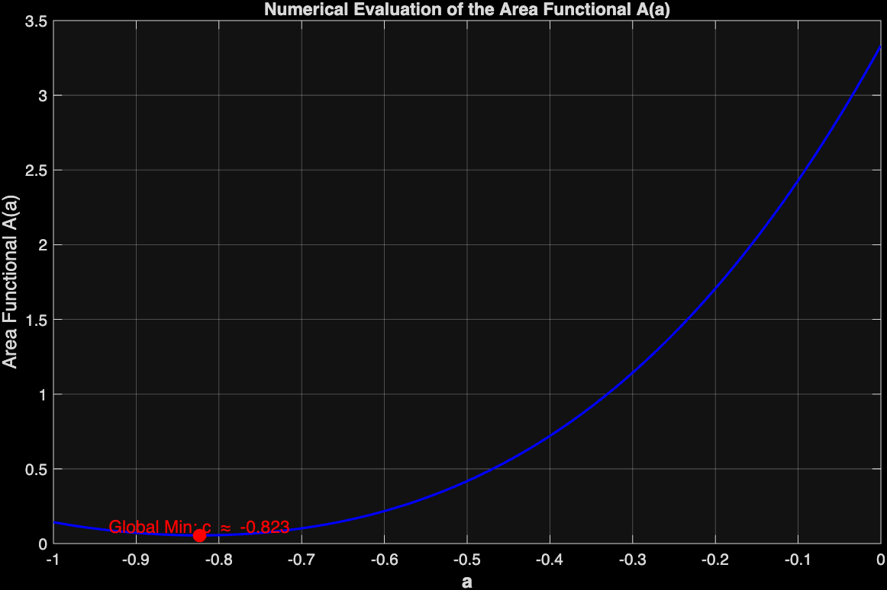

# Almgren Optimal Interval

MATLAB experiments supporting a proof about the localization of the minimizing interval in a simplified Almgren variational problem.

## Problem

Let f be a continuous function that is strictly decreasing on (-∞,0] and strictly increasing on [0,∞).

Define the area functional

A(a) = ∫_a^{a+1} f(x) dx.

The goal is to determine where the interval [a,a+1] should be placed to minimize the area under the curve.

The theoretical result shows that any minimizing interval must contain the origin.

## Computational Experiments

MATLAB was used to evaluate the area functional numerically and visualize how the minimum occurs when the interval contains the origin.

Example plot of the area functional:

## Repository Structure

src/  
MATLAB scripts used for numerical experiments.

src/utils/  
Helper scripts created during experimentation.

figures/  
Plots illustrating the behavior of the area functional.

paper/  
LaTeX source code for the research paper.

## Author

Abel E.
Kennesaw State University
